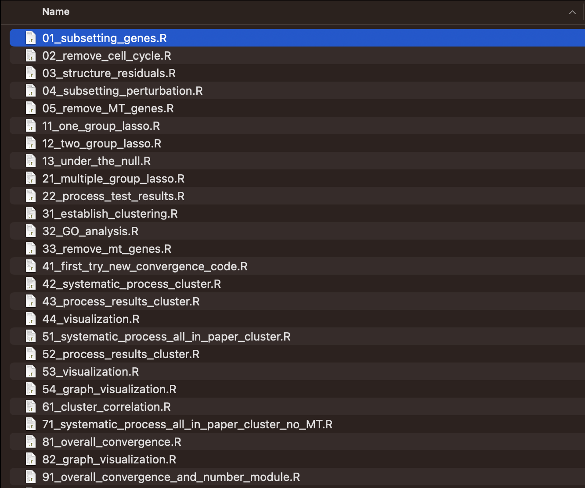
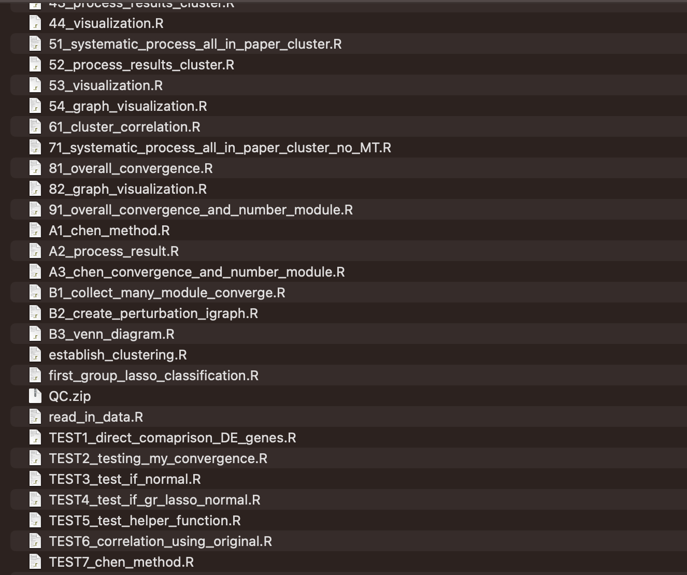
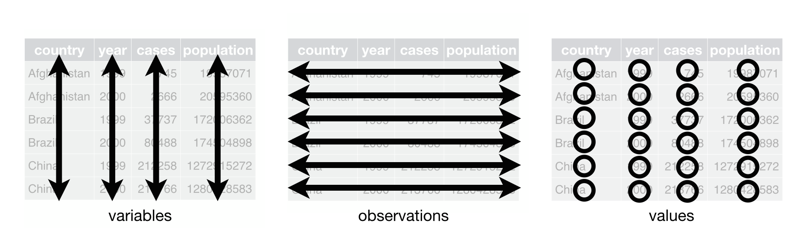
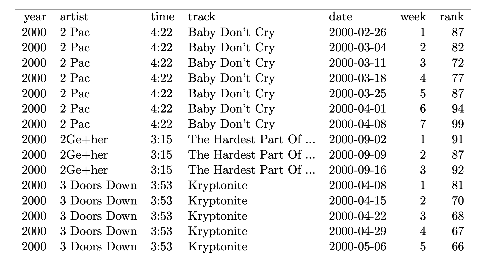
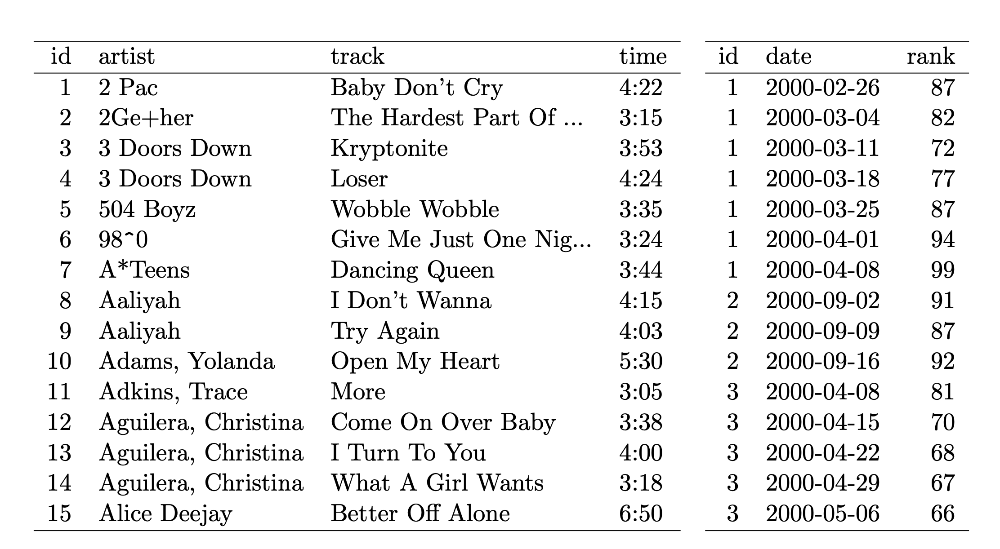
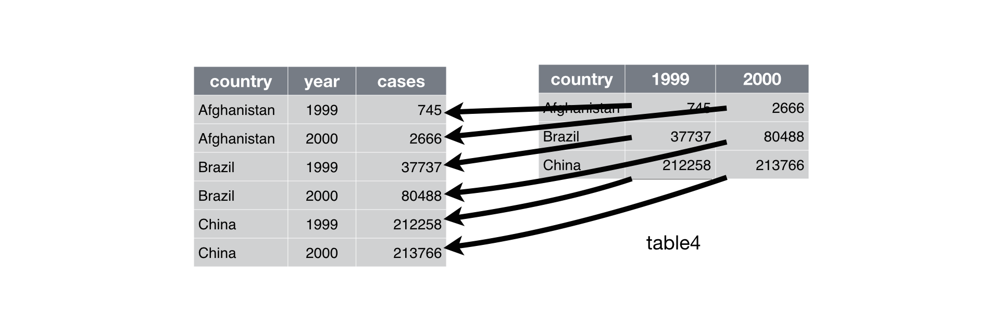
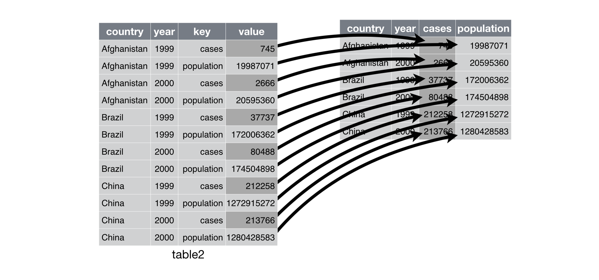
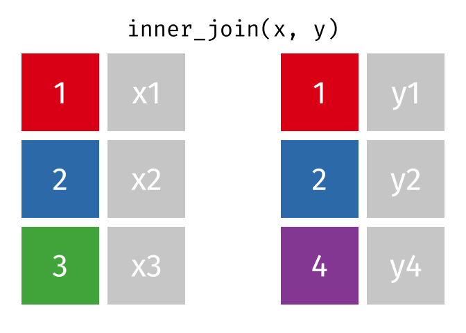
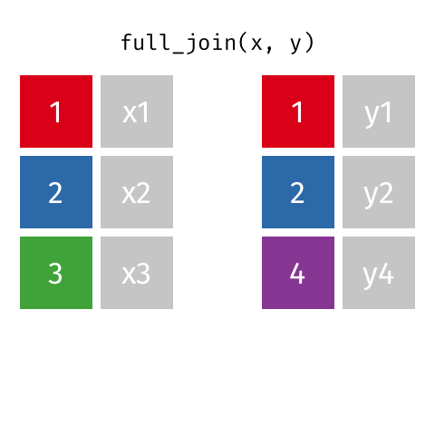

##

- File style and reproducible projects
- Tabular data and their layouts
- Tidy data as a standard for better layouts
- Tidying operations

# Reproducible projects

##

**File Style: Start Better From Day One**

. . . 

- Discoverability: find the right script or data quickly.
- Collaboration: consistent patterns reduce cognitive load.

. . . 

A modest goal: after stepping away for a month, the developer should still be able to navigate and understand the project’s basic structure.

**Tidyverse Style Guide**

> Source: <https://style.tidyverse.org/files.html>

## Names are hard

Make names both machine-readable and human-readable.

- Avoid spaces (not compatible with command line callings).
- Use hyphens `-` (kebab) or underscores `_` (snake).
- I personally prefer all lowercase file names.

```text
Fit models.R
```

**Better**

```text
fit_models.R
```

. . . 

- Names should evoke the contents.


```text
myreport.qmd
figure1.png
fig_another_try.png
```

**Better**

```text
report_homework2.qmd
fig_exploratory.png
fig_model_linear_reg.png
```

## Names — Play well with ordering

Very often, a sequence of scripts may be applied to some raw data sets. If order matters, you can try to encode it **at the start** of the name.

```text
01-first-look-data.R
02-tidy-data.R
03-exploratory-analysis.R
04-model-approach-1.R
05-model-approach-2.R
```

. . . 

First digit = main step; second digit = sub-step.

<center>{width=70%}</center>

. . . 

0-9, A, B,...

<center>{width=70%}</center>

Test scripts are placed at the end of the file sequence.

. . . 

As you will see, all the lecture notes will follow this naming pattern.

## Match output files to their generators

Keep output names consistent with the scripts that produce them.
This makes your project more self-documenting.

- 01-clean-data.R -> data/01-clean-data.csv
- 02-model-fit.R -> data/02-linear-model.rds
- 03-visualization.R -> figs/03-residual-plot.png

In `01-load-data.R`, write 

```{r, eval = FALSE}
write_csv(cleaned, file = "data/01-raw-clean.csv")
```


# Tabular data and their layouts
    
## Tabular data

Tabular data is the most common data storage format, but there are always multiple possible tabular layouts for the same underlying information.

## Reading data

Files in `.csv` format are easy to process. Almost a luxury in practice.

```{r}
library(tidyverse)
mammal_data <- read_csv("data/allison1976.csv")
mammal_data[, 1:6]
```

Function `read_csv` is part of the `readr` package (which is loaded when importing `tidyverse`). The `tibble` class are easier to examine than the default `data.frame`. 

```{r}
mammal_data <- read.csv("data/allison1976.csv")
mammal_data[, 1:6]
```

## Piping

- Pipes, `|>` or `%>%`, are used to chain a sequence of operations. 

- Makes code more readable and concise

- The pipe operator takes the output of one function and passes it as the first argument to the next function.

. . . 

- `%>%` in `tidyverse` syntax or `|>` from base R.

- There are subtle differences between them. I will try to stick to `|>`, which has slightly stricter syntax. 

## Piping
```{r}
mammal_data[startsWith(mammal_data$species, "African"), 
            c("species", "body_wt", "brain_wt")]
```

. . . 

is the same as...
```{r}
filtered_data <- filter(.data=mammal_data, 
                        startsWith(species, "African"))
select(filtered_data, species, body_wt, brain_wt)
```

. . . 

is the same as...
```{r}
## Piping approach
mammal_data |> 
  filter(startsWith(species, "African")) |> 
  select(species, body_wt, brain_wt)
```

. . . 

I used base R for many years and gradually shifted toward using piping because of its clarity.

## Long vs Wide Tables  

- Different layouts but the same information

- Different functions/tools require different layouts

- Let's explore the layouts and their tradeoffs

## Mammal data: long layouts

Below is the Allison 1976 mammal brain-body weight dataset shown in two 'long' layouts: 

```{r}
# import brain and body weights
mammal1 <- read_csv('data/allison1976.csv') |> select(1:3)
mammal1
```

## Longer layout

I can reorganize the numbers...

```{r, echo=FALSE}
mammal2 <- mammal1 |>
   pivot_longer(cols = contains("wt"), 
                names_to = "measurement",
                values_to="weight")
 mammal2
 # head(mammal2, n=5)
```

Is it a good idea to put the numerical values of body weights and brain weights in the same column?


## Wide format
```{r, echo=FALSE}
mammal3 <- mammal2 |> 
  pivot_wider(names_from = species, values_from = weight)
mammal3
```

```{r}
mammal3 |> rownames()
mammal3 |> colnames()
```

## GDP growth data: wide layout 

Here's another example: World Bank data on annual GDP growth for 264 countries from 1961 -- 2019. The raw layout is shown below.

```{r}
gdp1 <- read_csv('data/annual_growth.csv')
gdp1
```

Let us reflect on how the row and column numbers relate to the information encoded in the data.

## GDP growth data: long layout

Here's an alternative layout for the annual GDP growth data:

```{r, echo=FALSE}
gdp2 <- gdp1 |>
  pivot_longer(
    cols = -c(1, 2),
    names_to = "year",
    values_to = "GDP") |>
  arrange(year, `Country Name`)
gdp2
```

Now each row corresponds to a unique combination of country and year. Why this row number?

. . . 

```{r}
nrow(gdp1) * (ncol(gdp1) - 2) #264 * 59
```

## SB weather data: long layouts

A third example: daily minimum and maximum temperatures recorded at Santa Barbara Municipal Airport from January 2021 through March 2021.

```{r}
weather1 <- read_csv('data/sb_weather.csv')
weather1
```

Dates can be confusing. Some countries use MM/DD/YYYY, but some use YYYY/MM/DD or DD/MM/YYYY. Time zones and daylight saving changes.

## SB weather data: long layouts

```{r}
# convert to date format specifying month/day/year format
weather1 <- weather1 |> mutate(DATE = mdy(DATE)) 
## from the lubridate package, lubridate::mdy
weather1

```

. . . 

We can also separate the day, month and year.

```{r, echo=FALSE}
weather2 <- weather1 |> mutate(DAY = day(DATE), 
                                MONTH = month(DATE), 
                                YEAR = year(DATE)) 
weather2 |> select(DAY, MONTH, YEAR, TMAX, TMIN)
```

What is the maximum temperature of 1/7/2021?


## SB weather data: wide layouts

Not all datasets are stored in the most comprehensible format when we obtain them.

```{r, echo=FALSE}
weather3 <- weather2 |> select(-DATE) |> 
  pivot_longer(names_to="Type", values_to="Temp", cols=c("TMAX", "TMIN")) |> 
  pivot_wider(names_from=DAY, values_from=Temp)
weather3
```

What is the maximum temperature of 1/7/2021? Easier or harder to process the information than the previous layout?


## UN development data: multiple tables

A final example: United Nations country (and regions) development data organized into different tables according to variable type.

```{r}
undev1 <- read_csv('data/hdi3.csv', na = '..') |> select(-hdi_rank)
#not keeping column hdi_rank

undev2 <- read_csv('data/hdi2.csv', na = '..') |> 
    select(-one_of(c('hdi_rank', 'maternal_mortality')))
```

Here is a table of population measurements:

```{r}
undev1
```
And here is a table of a few gender-related variables:

```{r}
undev2
```

## UN development data: one table

```{r}
identical(undev1$country, undev2$country)
```

We combine / merge the two tables by country:

```{r, echo=FALSE}
undev_combined1 <- left_join(undev1, undev2, by = 'country')
undev_combined1
```

```{r, echo=TRUE}
glimpse(undev_combined1)
```

## UN development data: one (longer) table

And here is another arrangement of the merged table:

```{r, echo=FALSE}
undev_combined2 <- undev_combined1 |> 
    pivot_longer(
        cols = contains("gender") | contains("women") | contains("men"),
        names_to = "gender_variable",
        values_to = "gender_value"
    ) |> 
    pivot_longer(
        cols = contains("pop"),
        names_to = "population_variable",
        values_to = "population_value"
    )
undev_combined2
```

Same information but...

## Few organizational constraints

It's surprisingly difficult to articulate reasons why one layout might be preferable to another.

. . . 

Most data are stored in a layout that made intuitive sense to someone responsible for data management or collection at some point in time.

- Usually the choice of layout isn't principled

- Two people are likely to make different choices


## Consequences for the data scientist

Data scientists are constantly faced with determining how best to reorganize datasets in a way that **facilitates exploration and analysis**.

Broadly, this involves two interdependent choices:

. . . 

- *Choice of **representation**: how to encode information.*
    - Parse dates as 'YYYY-MM-DD' (one variable) or 'MM', 'DD', 'YYYY' (three variables)?
    - Use values 1, 2, 3 or 'low', 'med', 'high' for ordinal variables?
    
. . . 

- *Choice of **layout**: how to display information*
    - Wide table or long table?
    - One table or several tables?

# Tidy data as a standard for better layouts

## The Tidy data standard 

- **Tidy data** is one of the most important systematic efforts to answer a basic question: *what counts as a good tabular layout?*

**Credit**
- Articulated and popularized by **Hadley Wickham** (Journal of Statistical Software, 2014); his broader contributions were recognized with the 2019 COPSS Presidents’ Award.

## The tidy standard

A tabular data set is a collection of **values**. A data set conforming to the **tidy standard** is organized so that:

1. Each row corresponds to one observation unit (a person).
2. Each column corresponds to one variable (weight, height, ...).
3. Each type of observational unit forms a table (will be explained later).



> "Happy families are all alike; every unhappy family is unhappy in its own
way" *Leo Tolstoy*

## Tidy or messy?

Let’s learn about the tidy data standard through examples.

Suppose we want to create a table containing the body and brain weights for several species of mammals.

. . . 

It feels natural to treat one species as the observational unit.

. . . 

```{r}
mammal2
```

Is this layout tidy?

. . . 

No. A single observational unit is spread across multiple rows, which violates the tidy data principle that each observational unit should correspond to exactly one row.

<!-- A tidy format makes calculating brain weight percentage much simpler. -->


## Tidy or messy?

Suppose we are maintaining a table of annual GDP growth for several countries.

```{r}
head(gdp1, n=3)
```

A unique combination of country and year (USA, 1980) may be the natural observational unit.

Is this table tidy?

. . . 

Each row corresponds to many years of the same country, not tidy.

. . . 

However, for some analysis, one country may be viewed as the natural observational unit. If that is the case then the current table is OK (but I don't like it contains so many NAs that could have been avoided).

## Tidy or messy?

We want to tidy a table of Santa Barbara’s daily temperatures, including both the daily high and daily low. What would be a natural observational unit?

. . . 

One day?

```{r}
head(weather2, n=4)
```

Is this table tidy?

## Rule 3: One observational unit, one table

Billboard dataset. Records song rankings on the Billboard music chart in the year 2000. Here is one possible layout.



Each row records the rank of a song on a specific date.

. . . 

`artist`, `time` and `track` are repeated for every song. Columns 2-4, the observational unit is one song; Columns 5-7, the unit is the combination of song and date. 

Tidy standard states it is better to split into two tables




## Tidy or messy?

In `undev1` and `undev2`:

```{r}
undev1
```

```{r}
undev2
```

. . .

Here there are multiple tables.

* Are the observational units the same or different?
* Based on your answer above, is the data tidy or not?

    
# Long-wide conversion and table merging

##

**Long-wide conversion and table merging**

Common messes can be cleaned up by some simple operations:

. . . 

- `pivot_longer`
    - reshape a table from wide to long format

. . . 

- `pivot_wider`
    - reshape a table from long to wide format

. . . 

- *joins*
    - combine two tables row-wise by matching the values of certain columns
    
## `pivot_longer`

Pivoting longer resolves the problem of storing multiple observations in one row. 

<center>{width=80%}</center>

**Column names** become **values** in the table.

## `pivot_longer`

To illustrate with `gdp1`:

```{r}
head(gdp1, n=3)
```

Please read the comments for the three arguments:

```{r}
gdp1 |> pivot_longer(cols = 3:61, # which columns do I want to change into values?
                     names_to = "Year",   # store former column names as values under "Year"
                     values_to = "GDP") |>    # store the values of original columns under "GDP"
  arrange(`Country Name`, Year)  # sort the dataset by Country Name first, then by Year
```

## Pivoting to a wider format

Pivoting to a wider format resolves the issue of having one unit stored in multiple rows.

<center>{width=80%}</center>

**Values** are converted into **column names**.

## Pivot wider

For example, the `mammal2` layout can be put in tidier form with `pivot_wider`:

:::{.fragment}
```{r}
head(mammal2, n=3)
```
:::
:::{.fragment}
```{r}
mammal2 |> pivot_wider(
    names_from = 'measurement', # which variable(s) do you want to use as new column names?
    values_from = 'weight' # which variable(s) do you want to use to populate the new columns?
) 
```
:::

## Pivot longer and wider

Sometimes we have a combination of multiple messes. Table `weather3` illustrates this issue.

Let’s assume we agree that one day is the natural observational unit.

```{r}
weather3
```

## Pivot longer and wider

First `pivot_longer`...

```{r}
## First move date columns into a variable
weather3_long <- weather3 |> 
  pivot_longer(cols = 6:36, # original columns
    names_to = 'day', # new column storing column names
    values_to = 'temp')  |> # new column storing values 
  arrange(day)
weather3_long
```

##  Pivot longer and wider

Then ``pivot_wider``...
```{r}
weather3_tidy <- weather3_long |> 
  pivot_wider(names_from = "Type", # variable providing new column names
              values_from = "temp") # variable providing values for new columns
weather3_tidy
```


## Pivot longer and wider

**All in one chunk**

```{r}
## First move date columns into a variable
weather3 |> 
  pivot_longer(cols = 6:36,
               names_to = 'day',
               values_to = 'temp'
               ) |> 
  pivot_wider(names_from = Type, 
              values_from = temp)
```

## Inverted operations

`pivot_longer` transfers **column names** into **values**, then create another column to store original values.

<center>{width=80%}</center>

`pivot_wider` transfers **values** into **column names**, distributing the values from another to-be-eliminated column to the new ones 

<center>{width=80%}</center>


## Pivoting

<center></center>

## Joins

Joining resolves the issue of storing observations or variables on one unit type in multiple tables. The basic idea is to combine by matching rows.

## Joins

We saw two tables storing the UN development information during the last lecture.

```{r}
undev1
```

```{r}
undev2
```

## Joins

The code below combines columns in each table by matching rows based on country.

```{r}
undev_joint <- inner_join(undev1, undev2, by = 'country')
glimpse(undev_joint)
```

The two tables contain the same set of countries (and are even sorted in the same order!). Few decisions to make when merging them. Here we used `inner_join` for convenience.

## Why we need different types of joins

Suppose we have two tables: one recording GDP and another recording population. In both tables, the observational unit is country.

We want to join them to facilitate further analysis.

```{r}
GDP_table <- tibble(
  country = c("USA", "Canada", "Mexico"),
  gdp_trillion = c(25.5, 2.2, 1.3)   
)

pop_table <- tibble(
  country = c("Canada", "Mexico", "Brazil"),
  population_million = c(39, 126, 214)
)
```

- What would be the final table if I only want to keep countries that have both GDP and population information.

- Keep all countries from the GDP table and add population information when available.

- Keep all countries, whether they have GDP, population, or both.


## Different rules

There are various rules for exactly how to join, but the general procedure to merge dataframes is:

- Specify **keys**: the shared columns to use for matching rows of `GDP_table` with rows of `pop_table`.
    - for example, `country` was the **key**. 

- Specify a **rule** for how to handle unmatched rows. (e.g., `USA` in `GDP_table` but not in `pop_table`)

## Rule 1: inner join

Inner join: Keeps only keys that appear in both. (Keep only the `country`s appear in both `GDP_table` and `pop_table`.)
```{r}
inner_join(GDP_table, pop_table, by = "country")
```

<center></center>

## Rule 2: left join

Left join: Keeps all keys from the left table (`GDP_table`), adds matches from `pop_table` when available. If not matched, usually filled with `NA`. 

```{r}
left_join(GDP_table, pop_table, by = "country")
```

<center></center>

There is also a right join rule...

```{r}
right_join(GDP_table, pop_table, by = "country")
right_join(pop_table, GDP_table, by = "country")
```

## Rule 3: full/outer join

Full/Outer join: keep all rows from both

```{r}
full_join(GDP_table, pop_table, by = "country")
```

<center></center>

## Up next

- Slicing rows by column
- Filtering rows by logical conditions
- Defining new variables from scratch or by operations on existing variables (`mutate`)
- Aggregations (min, mean, max, etc.) 

## Visualization

Plotting libraries often operate in such a way that tidy data is easier to plot.

```{r}
#| output-location: fragment

weather1 |> ggplot(aes(x=DATE, y=TMAX)) + 
  geom_line()

```

## Exceptions?

There will be situations where you'll need to deviate from the tidy format for various purposes. 

Sometimes, plotting and table construction require reshaping data into non-tidy formats, for example:

```{r}
#| output-location: fragment

weather4 <- weather1 |> 
  pivot_longer(cols = c("TMIN", "TMAX"),
               values_to="Temp", 
               names_to="Min/Max")

weather4 |> ggplot(aes(x=DATE, y=Temp, col=`Min/Max`)) + 
  geom_line()
```

## Exceptions?

```{r}
#| output-location: fragment

mammal2 |> filter(species %in% c("Rabbit", "Raccoon", "Sheep")) |> 
  ggplot() + 
  geom_col(aes(y=weight, x=species, fill=measurement), 
           position="dodge") + 
  coord_flip()
```


## Tidy data is not easy to look at

- Tidy data is optimized for computation and visualization

- Most data in a spreadsheet won't be tidy!

- When presenting tables, tidy is usually not optimal

## Review: The Tidy Data Format

The tidy data format is defined by three key principles:

1. Each variable forms a column.
2. Each observation forms a row.
3. Each type of observational unit forms a table.

## The tidy format

Tidy data typically has these characteristics:

- Each cell contains a single value.
- Column headers are variable names, not values.
- Variables are stored in columns, not rows.
- Different types of variables are stored in different tables.


## Tidy Data Format

**Advantages:**

- Consistent format 
- Easy visualization with `ggplot2`
- Simplifies data manipulation.
  + Tools like dplyr and tidyr work efficiently with tidy data, making data transformation more straightforward.
- Facilitates analysis
  + Many statistical and machine learning functions in R expect data in a tidy format.

## Tidy Data Format

**Disadvantages:**

- Learning curve
- Storage inefficiency
- Not always intuitive
  + For some types of data or analyses, a wide format might be more natural 
  + Not good for examining by eye (e.g. in a spreadsheet)


## Review

- In tidy data, rows and columns correspond to observations and variables.
    - This provides a standard dataset structure that facilitates exploration and analysis.
    - Many datasets are not stored in this format.

- Transformation operations are a lot easier with tidy data.
    - Due in part to the way tools in pandas are designed.
    - The goal of lab 1 is to learn these operations.

- There are situations where non-tidy data is useful.
    - In PSTAT100, these will usually arise in plotting and tabulation tasks.

## Up next

* Slicing rows by column
* Filtering rows by logical conditions
* Defining new variables from scratch or by operations on existing variables (`mutate`)
* Aggregations (min, mean, max, etc.) 


# Appendix

## Advanced Tidying

Let's revisit the `billboard` dataset.

- Song rankings for Billboard top 100 in the year 2000

- Variables: `artist`, `track`, `date.enter` (data song entered the top 100) and `wk1`-`wk76`, the rank fo the song in each week after it entered.


```{r, echo=TRUE}
billboard |> select(1:10) 
```
<center>How to collect all the "weeks" into one variable?</center>

## Tidying Data

We can use `pivot_longer()`:

```{r, echo=TRUE}
#| output-location: fragment
billboard |> 
  pivot_longer(cols = starts_with("wk"), 
               names_to = "week", 
               values_to = "rank")
```
. . .

<center>What if we don't like the "wk" prefix.</center>

## Extra functions of `pivot_longer()`

```{r, echo=TRUE}
#| output-location: fragment
billboard_long <- billboard |> 
  pivot_longer(cols = starts_with("wk"), 
               names_to = "week", 
               names_prefix = "wk",  ## will remove wk for us
               values_to = "rank")
billboard_long
```

. . .

<center>See any other problems with `week`?</center>

## Extra functions of `pivot_longer()`

With one more tweak...

```{r, echo=TRUE}
billboard_long <- billboard |> 
  pivot_longer(cols = starts_with("wk"), 
               names_to = "week", 
               names_prefix = "wk", 
               names_transform = list(week = as.integer), 
               values_to = "rank")
billboard_long
```

Transformations of data frames are operations that modify the **shape**, **values**, or **class of values** of a data frame. (I didn’t expect `pivot_longer()` could do all three!)


