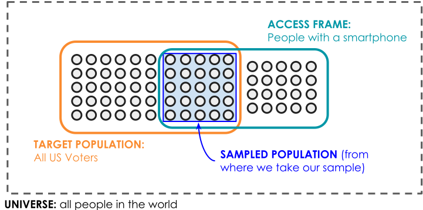
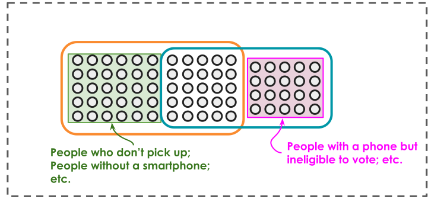

```{r setup, echo = F}
library(tidyverse)
library(countdown)
library(fixest)
library(modelsummary) # Make sure you have >=v2.0.0
library(GGally)
library(ggokabeito)
library(reshape2)
library(pander)
library(gridExtra)
library(cowplot)
library(patchwork)
```


## Why sampling?

Let's say we want to know the average body weight of a species of animal.

What we should do in practice depends on the specific kind...


## Case 1: Pinta Island tortoise

A recently extinct subspecies of Galápagos tortoise (2012)

Lonesome George, the last known individual of his species, at the Charles Darwin Research Station in 2006.

<center>{width="50%"}</center>

No statistics needed!

## Case 2: Vaquita

There are less than 20 alive. 

It is possible to conduct a **census**. In such cases, we can, in principle, measure every individual in the **target population**. In this case **sample** = **population**.

<center>{width="50%"}</center>

##  Case 3: Red-tailed hawk

There are hundreds of thousands across North America, including plenty here in Santa Barbara.

It’s not practical to conduct a **census** here (far too many, and they're hard to catch!).


<center>{width="50%"}</center>


## Population, frame, and sample

Researchers capture and band hawks so that individuals can be identified, measured and released. In this context, the following three sampling concepts are meaningfully different:

**target population**: All red-tailed hawks living in the Santa Barbara area. 

. . . 

**sampling frame**: Hawks that can be located and captured. Birds nesting outside the surveyed area are excluded from the sampling frame, because they are never encountered and it is not possible to sample them.

. . . 

**sample**: The 50 hawks that were captured and measured.

## Population, frame and sample
    
More generally,

-  **Target population**: the collection of individuals we aim to measure.

-   **Access/Sampling frame**: the population we can realistically sample from (we do not enforce it to be a strict subset of the target population).

-   **Sample**: the subset we actually observe.

## Another Example: Voter Turnout

Suppose we would like to determine which US voters are most likely to vote for a particular candidate in a local election, and suppose we do so by way of a text survey, i.e., a survey sent to people’s smartphones.

. . . 

Is a person who is eligible to vote, lives in this area, but does not have a phone included in the target population? Are they included in the sampling frame?

. . . 

Is a person who has a smartphone, lives in this area, but not eligible to vote included in the target population? Sampling frame?

## Example: Voter Turnout



## Example: Voter Turnout



# Simple random sampling and simulation realization

## Red-tailed hawk example

Suppose we're interested in determining the average beak-to-tail **length** of red-tailed hawks, to help differentiate them from other hawks by sight at a distance.

. . . 

Females and males differ slightly in length---females are generally larger than males.

. . . 

To simplify the discussion, we assume that every hawk in the area can be located and captured. Target population = sampling frame. 

```{r, echo = FALSE}
set.seed(8888)

n_female <- 250
n_male <- 250

female_hawks <- tibble(
  length = rnorm(n = n_female, mean = 57.5, sd = 3),
  sex = "female"
)

male_hawks <- tibble(
  length = rnorm(n = n_male, mean = 50.5, sd = 3),
  sex = "male"
)

hawk_pop <- bind_rows(female_hawks, male_hawks) |>
  mutate(bird_id = str_c("H", sprintf("%03d", row_number()))) |>
  select(bird_id, sex, length)

num_hawks <- nrow(hawk_pop)
population_mean <- mean(hawk_pop$length)
```

## Red-tailed hawk example

I simulated 500 "hawks" in my computer, each with an ID, a sex and a body length. Suppose this is the full target population (the "truth"), the complete information in `hawk_pop` is not available to the researcher in practice. They may only observe a subset of it.

```{r}
head(hawk_pop)

hawk_pop |> count(sex)
```

## Red-tailed hawk example

Here is a histogram of body lengths:

::: {.columns}
```{r, echo = FALSE}
ggplot(hawk_pop, aes(x = length)) +
  geom_histogram(binwidth = 0.75, fill = "lightgray", color = "black") +
  geom_vline(xintercept = population_mean, color = "#663B8C",
             linetype = "dashed", size = 1) +
  labs(
    title = "Population of Red-tailed Hawk Lengths (not known in practice)",
    x = "Length (cm)",
    y = "Number of birds"
  ) +
  annotate("text", x = population_mean + 1, y = 35,
           label = paste("True mean =", round(population_mean, 1)),
           color = "#663B8C", hjust = 0, size=5) +
  theme_bw(base_size=16)
```
:::

##

Here is the code used to generate this hawk population. 

```{r, eval = FALSE}
set.seed(8888)

n_female <- 250
n_male <- 250

female_hawks <- tibble(
  length = rnorm(n = n_female, mean = 57.5, sd = 3),
  sex = "female"
)

male_hawks <- tibble(
  length = rnorm(n = n_male, mean = 50.5, sd = 3),
  sex = "male"
)

hawk_pop <- bind_rows(female_hawks, male_hawks) |>
  mutate(bird_id = str_c("H", sprintf("%03d", row_number()))) |>
  select(bird_id, sex, length)

num_hawks <- nrow(hawk_pop)
population_mean <- mean(hawk_pop$length)
```

## Simple random sampling

**Simple random sampling** (SRS) is drawing a sample from a population where each individual has an equal chance of being selected.

The simplest study design but complicated enough for many topics in this course.

. . . 

- Population/ Access Frame: 500 red-tailed hawks with bird IDs.  
- Goal: select 50 hawks (sample size = 50).  
- Method: use a random number generator to choose 50 unique IDs.  

. . . 

SRS is simple and

- Ensures fairness and lack of systematic bias.  

## Simple random sampling

SRS in R.

```{r}
set.seed(123)
sample_size <- 50
sample_indices <- sample(1:num_hawks, sample_size)
hawk_sample_id <- hawk_pop |> 
                      slice(sample_indices) |>
                      pull(bird_id)

print(hawk_sample_id)
```

. . . 

Here are some arguments for the `sample()`.  What do they mean?

```{r, eval = F}
sample(x, size, replace = FALSE, prob = NULL)
```

`replace: Should sampling be with replacement?`

`prob: A vector of probability weights for obtaining the elements of the vector being sampled.`

## Simple random sampling

After a lot of field work... (but one click in simulations)

```{r}
hawk_sample <- hawk_pop |> slice(sample_indices)
hawk_sample
```

## Simple random sampling

Actually, `tidyverse` gives us a one line function to sample:

```{r}
hawk_sample <- hawk_pop |> 
  slice_sample(n = sample_size, replace=FALSE)
hawk_sample
```

## Simple Random Sampling

::: {.columns}
```{r}
#| output-location: slide
sample_mean <- mean(hawk_sample$length)

ggplot(hawk_sample) +
  geom_histogram(aes(x = length), 
                 binwidth = 0.75, fill = "lightgray", color = "black") +
  geom_vline(xintercept = sample_mean, color = "#663B8C",
             linetype = "dashed", size = 1) +
  labs(
    title = "Sample of Red-tailed Hawk Lengths (available)",
    x = "Length (cm)",
    y = "Number of birds") +
  annotate("text", x = sample_mean + 1, y = 6.5,
           label = paste("Sample Mean =", round(sample_mean, 1)),
           color = "#663B8C", hjust = 0) +
  theme_bw(base_size=16)
```
:::

## Simple Random Sampling

The sample mean was

```{r}
sample_mean
```

Recall the population mean 

```{r}
population_mean
```

They are not the same. We can oly perfect measure the population mean in a census.  From a SRS we only get an estimate.

## Partial knowledge learned from a sample

Let's review what we have done so far:

 - We defined a hawk population of interest.
 - We drew a sample of hawks from this population.
 - We applied a simple analysis procedure---taking the sample average.
 - We obtained an estimated population mean, which we may or may not trust.

## Partial knowledge learned from a sample

Some natural questions:

 - Did we introduce any systematic bias with our sample, leading to over- or under-estimation of the population mean?

 - Are we using the available samples as efficiently as possible to reduce estimation error?


# Sampling distribution

## Sampling Distribution

One of the most important steps in assessing the quality of an estimation or machine-learning procedure is understanding the **distribution** of the estimator (e.g., the sample mean).

You can do this formally using mathematics, or empirically using a computer to simulate its behavior.

## Distribution of sample mean

The sample mean is an estimator of the population mean.  It is a random variable, and the randomness comes from which individuals (from the population) happen to be selected in the sample. It therefore has its own probability distribution, called the **sampling distribution**.

## Distribution of sample mean

Formally, let $\hat \mu$ denote the sample mean, 
$$
\hat{\mu}=\frac{1}{n} \sum_{i=1}^n Y_{i}.
$$

It is a random variable, where $Y_{i}$ denotes the length of the $i$-th sampled hawk (which is also a random variable) and $n$ is the size of our sample.

. . . 

One of the most common misconceptions is to think that the sample mean $\hat{\mu}$ has a distribution similar to that of an individual observation $Y_i$. 


## Distribution of one sample {.smaller}

We denote the 500 hawks' (distinct) lengths as $L_1,...,L_{500}$ (they are fixed 500 numbers, no randomness). What is the distribution of the first sample $Y_{1}$ under SRS?

For example, what is 

$$
P(Y_1 = L_1) = ?
$$

Note that each hawk has an equal chance to enter the sample.

. . . 

$$
P(Y_1 = L_j) = \frac{1}{500},
$$
for all $j = 1,..,500$. It is a uniform discrete distribution over the fixed set of lengths. And $Y_2,...,Y_{50}$ each has the same distribution.

. . . 

But this is **not** the sampling distribution of $\hat \mu$.

## Distribution of $\hat \mu$

The exact distribution of the sample mean is hard to obtain except for limited special cases (e.g., each of $Y_1,...,Y_n$ follows a normal distribution). 

However, the Central Limit Theorem tells us what to expect with large enough sample sizes.

$$
\frac{1}{n}\sum_{i=1}^n Y_i \approx \mathcal{N}\left(\mu, \frac{\sigma^2}{n}\right)
$$

## An approximation of the sampling distribution

The concept of a sampling distribution is inherently counterfactual. In practice, we draw only one sample and obtain a single sample mean.

<span style="color: rgb(70, 70, 70);">*counterfactual: relating to or expressing what has not happened or is not the case.* </span>


. . . 

We need some imagination when thinking about the sampling distribution: we imagine many possible worlds, each conducting the same experiment but drawing different individuals from the same population.


## Approximating the Sampling Distribution with Simulation

```{r}
hawk_pop |> glimpse()

set.seed(123)

sample_size <- 50
num_reps <- 5e4
sample_means <- numeric(num_reps)

for (i in 1:num_reps) {
  sample_indices <- sample(1:nrow(hawk_pop), sample_size, replace = FALSE)
  sample_means[i] <- mean(hawk_pop[sample_indices, ]$length) 
  #why we didn't use |>, slice()....
}
sample_means |> head()
```

## An approximation of the sampling distribution
```{r}
#| output-location: slide
plot_df <- tibble(sample_mean = sample_means)
ggplot(data = plot_df, aes(x = sample_mean)) +
  geom_histogram(binwidth = 0.05, fill = "#3B8C66", color = "black") +
  geom_vline(xintercept = mean(hawk_pop$length),
             color = "#8C663c", linetype = "dashed", size = 1) +
  labs(
    title = "Distribution of the sample mean, from a simulation study",
    x = "Sample means",
    y = "Count"
  )+
  theme_bw(base_size=16)
```

. . . 

The histogram we obtained from repeated sampling provides a simulation-based approximation to the sampling distribution.

## Central Limit Theorem (CLT)

Although the original population distribution of hawk lengths is not normal, the sampling distribution of the sample mean is nearly normal.  

This is the Central Limit Theorem in action!

::: {.columns}

```{r, echo = F}
ggplot(data.frame(sample_mean = sample_means), aes(x = sample_mean)) +
geom_histogram(binwidth = 0.05, fill = "#3B8C66", color = "black") +
geom_vline(xintercept = mean(hawk_pop$length),
           color = "#8C663c", linetype = "dashed", size = 1) +
labs(
  title = "Sampling Distribution of the Mean",
  x = "Sample Mean Length (cm)",
  y = "Count"
) +
theme_bw(base_size=16)+  theme(plot.title = element_text(size = 20))

```
  
:::

The dashed line is the true population mean (which we don't know in practice)

$$
\mu = (500)^{-1}\sum_{i=1}^{500} L_i
$$

# Case study: SRS with and without replacemnet 

## Case study: SRS with and without replacemnet 

We will compare the estimation quality of SRS with and without replacement---our first methodological research project. 

<span style="color: rgb(70, 70, 70);">*Methodological research: an analysis of how good the analysis tool is.*</span>

## SRS without Replacement

In the previous scheme, we used sampling without replacement:  
we drew 50 hawks from the population simultaneously. Each hawk can appear at most once in the sample data frame.  

. . . 

Although it feels simple, this method creates a complicated relationship between the samples:

- The samples $Y_1,...,Y_n$ are not independent:  
  if $Y_1 = L_1$, it is not possible to have $Y_2 = L_1$.  

Formally, $Y_{i}$ and $Y_{j}$ are not independent for $1\leq i\neq j \leq n$.

$$
P(Y_i = L_1) \neq P(Y_i = L_1 \mid Y_j = L_1)
$$

## SRS with replacement

We draw one hawk, measure its length, put it back and then draw the next one.

- With sampling with replacement, each draw is independent.  
  This matches the i.i.d. (independent and identically distributed) framework that often appears in the data science literature.  
  
$$
P(Y_i = L_1) = P(Y_i = L_1 \mid Y_j = L_1)
$$

. . . 

They are different strategies to estimate the same quantity (the population mean). Do they offer difference estimation accuracy in our hawk example?

## SRS with replacement

We can use simulation to answer this. We already created an approximation of the sampling distribution for SRS **without** replacement.

Now we create that of SRS with replacement.

. . . 

```{r}
#one sample
set.seed(1)
sample_indices <- sample(1:num_hawks, sample_size, 
                         replace = TRUE) #default is FALSE
hawk_sample_id <- hawk_pop[sample_indices, ]$bird_id

print(head(hawk_sample_id, n = 20))
```

```{r}
hawk_sample <- hawk_pop[sample_indices, ]
head(hawk_sample)
```


::: {.columns}
```{r, echo = FALSE}
sample_mean <- mean(hawk_sample$length)

ggplot(hawk_sample, aes(x = length)) +
  geom_histogram(binwidth = 0.75, fill = "lightgray", color = "black") +
  geom_vline(xintercept = sample_mean, color = "#663B8C",
             linetype = "dashed", size = 1) +
  labs(
    title = "Sample of Red-tailed Hawk Lengths (available)",
    x = "Length (cm)",
    y = "Number of birds"
  ) +
  annotate("text", x = sample_mean + 1, y = 3,
           label = paste("Mean =", round(sample_mean, 1)),
           color = "#663B8C", hjust = 0) +
  theme_bw(base_size=16)
```
:::

Recall the population mean 

```{r}
population_mean
```

## Sampling distributions

Repeat the sampling process to obtain the sampling distributions for both methods.

:::: {.columns}
::: {.column width="50%"}
```{r}
set.seed(123)

num_reps <- 5e4
sample_means <- numeric(num_reps)

for (i in 1:num_reps) {
  sample_indices <- sample(1:num_hawks, sample_size, replace = FALSE)
  sample_means[i] <- mean(hawk_pop[sample_indices, ]$length)
}
```

```{r, echo = F}
ggplot(data.frame(sample_mean = sample_means), aes(x = sample_mean)) +
  geom_histogram(binwidth = 0.05, fill = "#3B8C66", color = "black") +
  geom_vline(xintercept = mean(hawk_pop$length),
             color = "#8C663c", linetype = "dashed", size = 1) +
  labs(
    title = "Without replacement",
    x = "Sample Mean Length (cm)",
    y = "Count"
  )+
  theme_bw(base_size=16)
```

```{r}
mean(sample_means) # our simulation approximate of E[\hat \mu_{without}]
var(sample_means) # our simulation approximate of Var[\hat \mu_{without}]
```

:::

::: {.column width="50%"}
```{r}
set.seed(123)

num_reps <- 5e4
sample_means_replacement <- numeric(num_reps)

for (i in 1:num_reps) {
  sample_indices <- sample(1:num_hawks, sample_size, replace = TRUE)
  sample_means_replacement[i] <- mean(hawk_pop[sample_indices, ]$length)
}
```

```{r, echo = FALSE}
ggplot(data.frame(sample_mean = sample_means_replacement), 
       aes(x = sample_mean)) +
  geom_histogram(binwidth = 0.05, fill = "#3B8C66", color = "black") +
  geom_vline(xintercept = mean(hawk_pop$length),
             color = "#8C663c", linetype = "dashed", size = 1) +
  labs(
    title = "With replacement",
    x = "Sample Mean Length (cm)",
    y = "Count"
  )+
  theme_bw(base_size=16)
```

```{r}
mean(sample_means_replacement) # our simulation approximate of E[\hat \mu_{with}]
var(sample_means_replacement) # our simulation approximate of Var[\hat \mu_{with}]
```

:::
::::

a) Do both the sample means, on average, estimate the population mean well?  $E[\hat \mu_{without}] = \mu$? $E[\hat \mu_{with}] = \mu$?
```{r}
population_mean
```

. . . 

b) I claim
```{r}
var(hawk_pop$length)/sample_size
```

should be the theoretical variance of one of the estimators above. Is it $Var(\hat \mu_{\rm without})$ or $Var(\hat \mu_{\rm with})$?

## Sampling distributions

Both are close to normal (sample size = 500). 

:::: {.columns}
::: {.column width="50%"}
```{r}
set.seed(123)

num_reps <- 5e4
sample_means <- numeric(num_reps)

for (i in 1:num_reps) {
  sample_indices <- sample(1:num_hawks, sample_size, replace = FALSE)
  sample_means[i] <- mean(hawk_pop[sample_indices, ]$length)
}
```

```{r, echo = F}
ggplot(data.frame(sample_mean = sample_means), aes(x = sample_mean)) +
  geom_histogram(binwidth = 0.05, fill = "#3B8C66", color = "black") +
  geom_vline(xintercept = mean(hawk_pop$length),
             color = "#8C663c", linetype = "dashed", size = 1) +
  labs(
    title = "Without replacement",
    x = "Sample Mean Length (cm)",
    y = "Count"
  )+
  theme_bw(base_size=16)+
  theme(
    plot.title = element_text(size = 40)
  )
```

```{r}
mean(sample_means)
var(sample_means)
```

:::

::: {.column width="50%"}
```{r}
set.seed(123)

sample_size <- 50
num_reps <- 5e4
sample_means_replacement <- numeric(num_reps)

for (i in 1:num_reps) {
  sample_indices <- sample(1:num_hawks, sample_size, replace = TRUE)
  sample_means_replacement[i] <- mean(hawk_pop[sample_indices, ]$length)
}
```

```{r, echo = FALSE}
ggplot(data.frame(sample_mean = sample_means_replacement), 
       aes(x = sample_mean)) +
  geom_histogram(binwidth = 0.05, fill = "#3B8C66", color = "black") +
  geom_vline(xintercept = mean(hawk_pop$length),
             color = "#8C663c", linetype = "dashed", size = 1) +
  labs(
    title = "With replacement",
    x = "Sample Mean Length (cm)",
    y = "Count"
  )+
  theme_bw(base_size=16)+
  theme(
    plot.title = element_text(size = 40)
  )
```

```{r}
mean(sample_means_replacement)
var(sample_means_replacement)
```

:::
::::

Theory suggests that hte ratio of the variances between the two estimators, ${\rm Var}(\hat \mu_{\rm without})/{\rm Var}(\hat \mu_{\rm with})$, should be roughly 

```{r}
(num_hawks - sample_size) / (num_hawks - 1)
```

Does our numerical investigation support this post?

## In Sim We Trust

By generating artificial data under controlled conditions, simulations allow us to assess how different method perform. We do care about the tools and algorithms to be applied rather than the simulated data.

. . . 

We assessed the quality of sample means with and without replacement by examining their means and variances.
. . . 

Both are **unbiased**: The estimators sometimes overestimate and sometimes underestimate, but on average, they recover the population mean accurately.

Formally, we observed that both $\tilde E[\hat \mu_{with}]$ and $\tilde E[\hat \mu_{without}]$ are very close to $\mu$. 

Here $\tilde E[\hat \mu_{with}]$ is the simulation approximation of $E[\hat \mu_{with}]$. They are never exactly the same, but the more repeats I use in my simulation, the closer these two become.

## "With" vs "without" replacement

Sampling without replacement is more **efficient** because we observed $\tilde{\rm Var}[\hat \mu_{\rm without}]$ is smaller than $\tilde{\rm Var}[\hat \mu_{\rm with}]$.

(Here $\tilde{\rm Var}[\hat \mu_{with}]$ is the simulation approximate of ${\rm Var}[\hat \mu_{with}]$).

In practice, we often prefer an estimator with smaller variance as it is on average closer to the truth $\mu$.

. . . 

_Note_: For an unbiased estimator, variance = average squared distance between $\hat \mu$ and $\mu$. 

$$
E[(\hat \mu - \mu)^2] = E[(\hat \mu - E[\hat \mu])^2] = Var(\hat \mu) 
$$

$$
E[(\hat \mu_{without} - \mu)^2] < E[(\hat \mu_{with} - \mu)^2]
$$


## Comparing theory and simulation

```{r}
(num_hawks - sample_size) / (num_hawks - 1)
```

```{r}
var(sample_means)/var(sample_means_replacement)
```

The theory matches the simulation: without replacement is 90% the variance of with replacement.

In this case, sampling without replacement yields smaller a variance (and thus better) estimator!

## Challenge

It is standard to calculate the variance of $\hat \mu_{with}$ for IID $Y_i$:

$$
{\rm Var}[\hat \mu_{with}] = n^{-1}{\rm Var}(Y_1)
$$

But what about ${\rm Var}[\hat \mu_{without}]$?

## Swain's Jury Panel Case Study

The following case study highlights the ethical importance and implications surrounding sampling. 

-   In 1962, Robert Swain was charged and convicted with committing a crime in Alabama's Talladega County, which had the possibility of a death sentence.

-   Prior to his trial and after his conviction, his lawyers argued that Black citizens of Talladega were systematically excluded from grand juries such as Swain's case, which violated the right to an impartial jury guaranteed in the U.S. Constitution.

## Swain's Jury Panel Case Study


-   Jurors are to be selected from a jury panel of 100 citizens which should be representative of a region's eligible population. At the only men 21 years and older were allowed to serve as jury members.

-   During Swain's trial, **26%** of males in Talladega County were Black, however the jury panel consisted of only **8** Black males out of 100, in other words Black males made up 8% of the jury panel (and none actually served on the final jury!).

-   Swain's lawyers appealed his conviction arguing that he was not given an opportunity to **fair trial** due to lack of representation of Black males on the jury panel.

- We can use simulation to explore whether the simple random sampling was violated when choosing the jury pool

## Swain's Jury Panel Case Study: Jury Pool
 
First we generate a simulated population of 10000 individuals (26% white and 74\% white)

```{r JuryPool}
#| fig-width: 6
#| fig-height: 3
#| fig-align: center

# Set seed for reproducibility
set.seed(1234)
n <- 100
pop_size <- 10000


# Create dataset of size pop_size representing Talladega County demographics
true_population <- tibble(
  id = 1:pop_size,
  age = sample(21:80, size = pop_size, replace = TRUE),   
  race = sample(c("white", "black"), size = pop_size, replace = TRUE, prob = c(0.74, 0.26))   
)
```

## Swain's Jury Panel Case Study: Jury Pool

```{r JuryPoolSampling}
#| output-location: slide
# Generate random samples from the population
# Each sample represents a potential jury panel of 100 people
num_reps <- 1000
sample_count_replacement <- numeric(num_reps)
for(i in 1:num_reps) {
    sample_pop <- true_population |> slice_sample(n = 100, replace = FALSE) 
  sample_count_replacement[i] <- sum(sample_pop$race == "black")
}

mean_black <- mean(sample_count_replacement)

# Create ggplot histogram
tibble(replicate_id = 1:num_reps, black_count = sample_count_replacement) |> 
  ggplot(aes(x = black_count)) +
  geom_histogram(binwidth = 1, fill = "lightblue", color = "black", alpha = 0.7) +
  geom_vline(xintercept = mean_black, linetype = "dashed", color = "darkblue", size = 1,
             ) +
  geom_vline(xintercept = 8, linetype = "dashed", color = "red", size = 1) +
  labs(
    title = "Simulation: Number of Black Citizens in a Jury Panel",
    x = "Count of Empaneled Black Jurors",
    y = "Number of Simulated Jury Panels"
  ) +
  xlim(0, 50) +
  theme_bw(base_size=16) +
  annotate("text", x = 8 + 2, y = max(table(sample_count_replacement)) * 0.6, 
           label = "Swain's Panel = 8", color = "red", angle = 90)
```

## Swain's Jury Panel Case Study: Jury Pool

-   What do you observe in the plot? Evaluate the range and the mean of possible number of Black males that could have been selected for the jury panel. 

-   What does the **distribution** of randomly selected samples and actual count of jurors suggest about the jury panel in Swain's case? Is the difference small? 

## Swain's Jury Panel Case Study: Jury Pool

Consider the following hypothetical scenarios:

-   What if the panel of jurors consisted of 15 Black males?

-   Would a higher count of Black panelists automatically lead to fair panel or impartial jury?

-   Would you consider a panel of 21 Black males fair?


## Example with 15 black males

```{r JuryPool2, echo=FALSE}
# Calculate proportion with 15 or fewer black jurors
prop_le_15 <- mean(sample_count_replacement <= 15)

# Create ggplot histogram with line at 15
ggplot(tibble(black_count = sample_count_replacement), aes(x = black_count)) +
  geom_histogram(binwidth = 1, fill = "lightblue", color = "black", alpha = 0.7) +
  geom_vline(xintercept = mean_black, linetype = "dashed", color = "darkblue", size = 1) +
  geom_vline(xintercept = 15, linetype = "dashed", color = "red", size = 1) +
  labs(
    title = "15 Black Males on the Jury Panel",
    x = "Count of Randomly Selected Impaneled Black Jurors",
    y = "Number of Simulated Jury Panels"
  ) +
  xlim(0, 50) +
  theme_bw(base_size=16) +
  annotate("text", x = 2, y = max(table(sample_count_replacement)) * 0.9, 
           label = paste0("Prop ≤ 15: ", round(prop_le_15, 3)), 
           size = 4, hjust = 0, 
           bbox = list(boxstyle = "round,pad=0.3", facecolor = "white", edgecolor = "black")) -> j2
j2
```

## Example with 21 black males

```{r, echo=FALSE}
# Calculate proportion with 21 or fewer black jurors
prop_le_21 <- mean(sample_count_replacement <= 21)

# Create ggplot histogram with line at 21
ggplot(tibble(black_count = sample_count_replacement), aes(x = black_count)) +
  geom_histogram(binwidth = 1, fill = "lightblue", color = "black", alpha = 0.7) +
  geom_vline(xintercept = mean_black, linetype = "dashed", color = "darkblue", size = 1) +
  geom_vline(xintercept = 21, linetype = "dashed", color = "red", size = 1) +
  labs(
    title = "21 Black Males on the Jury Panel",
    x = "Count of Randomly Selected Impaneled Black Jurors",
    y = "Number of Simulated Jury Panels"
  ) +
  xlim(0, 50) +
  theme_bw(base_size=16) +
  annotate("text", x = 2, y = max(table(sample_count_replacement)) * 0.9, 
           label = paste0("Prop ≤ 21: ", round(prop_le_21, 3)), 
           size = 6, hjust = 0, 
           bbox = list(boxstyle = "round,pad=0.3", facecolor = "white", edgecolor = "black")) -> j3

j3
```


# Case study: biased sampling and bias correction

## Sampling bias

Let's return to the hawk example.  So far we assumed every hawk was equally likely to enter the sample---$p_i = p_j$ for every pair of units. *Sampling bias* can arise from sampling mechanisms where that is not true.

::: {.columns}

::: {.column width="60%"}
```{r, echo = FALSE}
#| fig-width: 5
#| fig-height: 5
#| warning: false

base <- ggplot(hawk_pop, aes(x = length))

hist_bysex <- base +
  geom_histogram(aes(fill = sex), binwidth = 0.75, alpha = 0.5,
                 position = "identity", boundary = 0) +
  scale_x_continuous(limits = c(40, 70)) +
  scale_fill_manual(values = c("red", "blue")) +
  labs(x = "Length (cm)", y = "Number of birds") +
  theme_bw(base_size=16) +
  theme(legend.position = "bottom")

hist_all <- base +
  geom_histogram(binwidth = 0.75, fill = "red", alpha = 0.5, boundary = 0) +
  scale_x_continuous(limits = c(40, 70)) +
  labs(x = "Length (cm)", y = "Number of birds") +
  theme_bw(base_size=16)

hist_bysex / hist_all
```
:::

::: {.column width="40%"}
Consider:

1. Are males or females generally longer?
2. How will the sample mean shift if disproportionately more males are sampled?
:::

:::

## Statistical bias

Statistical **bias** is the average difference between a sample property and a population property across all possible samples under a particular sampling design.

In less technical terms: the expected error of estimates.

. . . 

Two possible sources of statistical bias:

* An estimator systematically over- or under-estimates its target population property
    + *e.g.*, $\frac{1}{n}\sum_i (x_i - \bar{x})^2$ is biased for (underestimates) the population variance
* Sampling design systematically over- or under-represents certain observational units
    + *e.g.*, studies conducted on college campuses are biased towards (overrepresent) young adults

## Sampling mechanisms

Each unit has some **inclusion probability**---*the probability of being included in the sample*.

Let's suppose that the frame comprises $N$ units, and denote the inclusion probabilities by:

$$
p_i = P(\text{unit } i \text{ is included in the sample})
\quad i = 1, \dots, N
$$

## Sampling mechanisms {.smaller}

* In a **census** every unit is included
    + $p_i = 1$ for every unit $i = 1, \dots, N$
* In a **simple random sample** every unit is equally likely to be included
    + $p_i = p_j$ for every pair of units $i, j$
* In a **probability sample** units have different inclusion probabilities
    + $p_i \neq p_j$ for at least one $i \neq j$
* In a **nonrandom sample** there is no random mechanism
    + $p_i = 1$ for $i \in S$

When are nonrandom samples more appropriate than SRS or probability samples?

## A biased sampling design

Usually, length measurements are collected from dead specimens collected opportunistically. Imagine that *female* mortality is higher, so there are better chances of finding dead females than dead males.

Suppose in particular that female hawks are 9 times as likely to be selected as males.

```{r}
hawk_pop_wt <- hawk_pop |>
  mutate(samp_weight = if_else(sex == "female", 9, 1))

head(hawk_pop_wt)
```

::: {.columns}
```{r, echo = FALSE}
#| fig-width: 5
#| fig-height: 5
#| warning: false

wt <- tibble(
  length = c(50.5, 57.5),
  weight = c(1, 9) / 10,
  sex = c("male", "female")
) |>
  ggplot(aes(x = length, y = weight, fill = sex)) +
  geom_bar(stat = "identity", alpha = 0.5) +
  scale_x_continuous(limits = c(40, 70)) +
  scale_y_continuous(limits = c(0, 1)) +
  scale_fill_manual(values = c("red", "blue")) +
  labs(x = "Length (cm)", y = "Sampling weight") +
  theme_bw(base_size=16) +
  theme(legend.position = "bottom")

hist_bysex / wt
```
:::

## One biased sample

We draw 50 hawks, weighted by `samp_weight`:

```{r}
set.seed(8888)
biased_n <- 50

samp <- hawk_pop_wt |> slice_sample(n = biased_n, weight_by = samp_weight)

samp |> count(sex)
```

. . . 

This yields an overestimate:

```{r}
cat('population mean: ', mean(hawk_pop$length), "\n")
cat('sample mean: ', mean(samp$length), "\n")
```

## Is it biased, or were we unlucky?

Just as before, we repeat the sampling process many times and look at the sampling distribution of $\hat \mu$.


```{r}
set.seed(40221)
N_repeat <- 1e3

repeat_result <- tibble()
for (repeat_index in 1:N_repeat) {
  samp_rep <- hawk_pop_wt |> 
    slice_sample(n = biased_n, weight_by = samp_weight)
  
  repeat_result <- rbind(
    repeat_result,
    tibble(repeat_index = repeat_index,
           sample_mean = mean(samp_rep$length))
  )
}
```

## Is it biased, or were we unlucky?
```{r, echo = FALSE}
#| warning: false
ggplot(repeat_result) +
  geom_histogram(aes(x = sample_mean), binwidth = 0.1,
                 fill = "#3B8C66", color = "black") +
  geom_vline(xintercept = population_mean,
             linetype = "dashed", color = "black", linewidth = 1) +
  labs(title = "Biased sampling design",
       x = "Sample Mean Length (cm)", y = "Count") +
  xlim(c(50, 59)) +
  theme_bw()
```


```{r}
mean(repeat_result$sample_mean) - population_mean # the bias
```

The estimator is off by about the same amount in *every* possible counterfactual. That is bias, not bad luck.

## Bias correction {.smaller}

If inclusion probabilities are known or estimable it is possible to apply bias corrections to estimates using **inverse probability weighting** (IPW).

. . . 

If 

* $p_i$ is the probability that individual $i$ is included in the sample $S$
* $Y_i$ are observations of a variable of interest

Then a bias-corrected estimate of the population mean is given by the weighted average:

$$
\sum_{i\in S} \left(\underbrace{\frac{p_i^{-1}}{\sum_i p_i^{-1}}}_{\text{bias adjustment}}\right) Y_i
$$

. . . 

The idea is simple---up-weight observations with a lower sampling weight and down-weight observations with a higher sampling weight.

## Bias correction example

Since we know the exact inclusion probabilities up to a proportionality constant, we can apply inverse probability weighting to adjust for bias:

```{r}
samp_w <- samp |>
  mutate(
    correction_factor = (1/samp_weight) / sum(1/samp_weight),
    weighted_length = length * correction_factor
  ) |>
  summarise(weighted_mean = sum(weighted_length)) |>
  pull(weighted_mean)

cat('population mean: ', mean(hawk_pop$length), "\n")
cat('sample mean: ', mean(samp$length), "\n")
cat('weighted average: ', samp_w, "\n")
```

## Bias correction example

However, even if we *didn't* know the exact inclusion probabilities, we could estimate them from the sample:

```{r}
table(samp$sex)
```

. . . 

And use the same approach:

```{r}
# ratio of females to males in the sample
ratio <- samp |>
  count(sex) |>
  pivot_wider(names_from = sex, values_from = n) |>
  mutate(ratio = female/male) |>
  pull(ratio)

weight_df <- tibble(
  sex = c("male", "female"),
  est_weight = c(1, ratio)
)

samp_w <- samp |>
  left_join(weight_df, by = "sex") |>
  mutate(
    correction_factor = (1/est_weight) / sum(1/est_weight),
    weighted_length = length * correction_factor
  ) |>
  summarise(weighted_mean = sum(weighted_length)) |>
  pull(weighted_mean)

print(samp_w)
```

## Does the correction work on average?

One sample is not enough to tell. We repeat the whole pipeline---draw a biased sample, then apply IPW---and look at the sampling distribution of both estimators.


```{r}
set.seed(40221)

repeat_result <- tibble()
for (repeat_index in 1:N_repeat) {
  samp_rep <- hawk_pop_wt |> 
    slice_sample(n = biased_n, weight_by = samp_weight)
  
  est_naive <- mean(samp_rep$length)
  
  weight <- 1 / samp_rep$samp_weight
  est_ipw <- sum(weight * samp_rep$length) / sum(weight)
  
  repeat_result <- rbind(
    repeat_result,
    tibble(repeat_index = repeat_index,
           est_naive = est_naive,
           est_ipw = est_ipw)
  )
}
repeat_result |> head(n = 3)
```

## Does the correction work on average?
```{r, echo = FALSE}
#| warning: false
repeat_result |>
  pivot_longer(c(est_naive, est_ipw),
               names_to = "estimator", values_to = "estimate") |>
  mutate(estimator = factor(estimator, levels = c("est_naive", "est_ipw"),
                            labels = c("sample mean", "IPW"))) |>
  ggplot() +
  geom_histogram(aes(x = estimate), binwidth = 0.1,
                 fill = "#3B8C66", color = "black") +
  geom_vline(xintercept = population_mean,
             linetype = "dashed", color = "black", linewidth = 1) +
  facet_wrap(~ estimator, ncol = 1) +
  labs(x = "Estimate of mean length (cm)", y = "Count") +
  xlim(c(50, 59)) +
  theme_bw(base_size=16)
```


```{r}
mean(repeat_result$est_naive) - population_mean # bias of the sample mean
mean(repeat_result$est_ipw) - population_mean   # bias of the IPW estimate
```

## Does the correction work on average?

- The sample mean is **biased**: it over-estimates $\mu$ in nearly every repetition.

- The IPW estimate is (essentially) **unbiased**: it recovers $\mu$ on average.

. . . 

- But the correction is not free---compare the spreads:

```{r}
sd(repeat_result$est_naive)
sd(repeat_result$est_ipw)
```

IPW removes the bias at the cost of a larger variance, because the few males in the sample carry most of the weight.

This is called the "bias / variance tradeoff" and is extremely important in all of statistics

## Remarks on IPW and bias correction

Inverse probability weighting can be applied to correct a wide range of estimators besides averages.

. . . 

It is also applicable to adjust for bias due to missing data.

. . . 

In principle, the technique is simple, but in practice, there are some common hurdles:

- usually inclusion probabilities are not known
- estimating inclusion probabilities can be difficult and messy

## When simple isn’t so simple

What is the average family size (children only) in a region, including couples without children?

Will the following sampling scheme give us unbiased results?

. . . 

Suppose I can obtain a list of all the children in this area.
I use SRS to select a subset of them, visit them, and ask their family size.
Then I take an average of the numbers recorded.

## Family size estimation

It may be easy to imagine that sampling children would lead to an over-estimate, as children from a larger family are more likely to be sampled.

Consider an extreme case where there are two families of very different sizes.

. . . 

If we want to perform SRS, *the sampling unit should be the family*. Highlights the importance of thinking carefully about the sampling unit as well as the estimation strategy.


